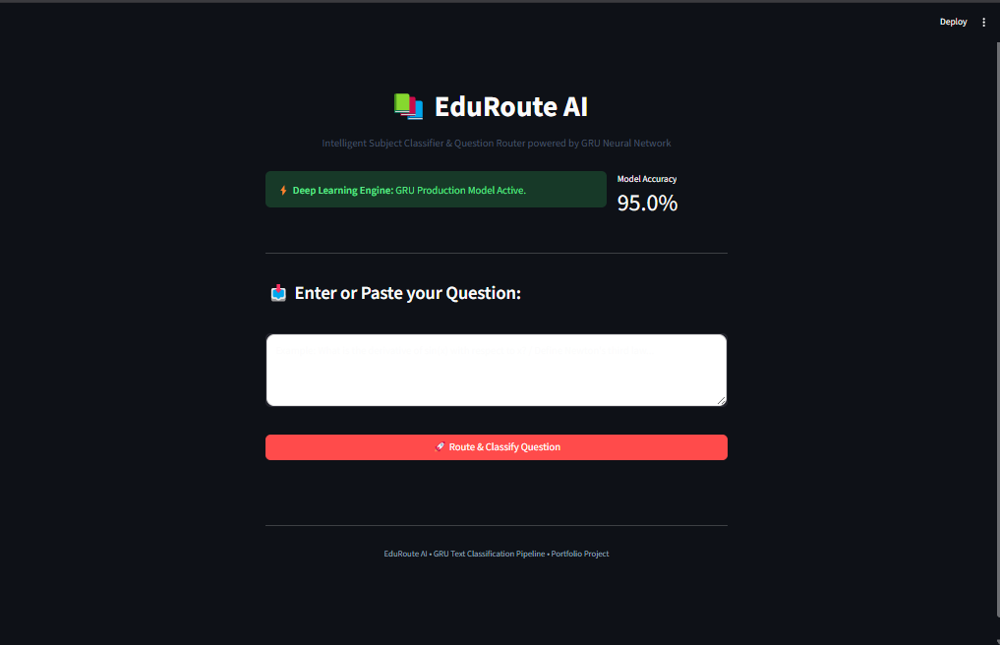

# 🧠 Multi-Class Subject Question Classifier using Artificial Neural Networks (ANN)

An end-to-end Deep Learning project that classifies educational questions into their respective subjects using an **Artificial Neural Network (ANN)** architecture. Trained on the `subjects-questions.csv` dataset, the multi-class model achieves a high classification **accuracy of 95%**.

---

## 🚀 Live Demo & Web App Preview

[](https://your-app-name.streamlit.app)

👉 **[Click here to access the Live Web Application](https://multi-class-subject-question-classifier-ann-git-gjmsvdcqebqy9c.streamlit.app/)**

<div align="center">
  
  <p><i>Figure: Interactive Streamlit UI for Multi-Class Subject Question Prediction</i></p>
</div>

---

## 📌 Table of Contents

- [Executive Summary](#-executive-summary)
- [Live Demo & Web App Preview](#-live-demo--web-app-preview)
- [Repository Directory Structure](#-repository-directory-structure)
- [Key Features](#-key-features)
- [Performance Metrics](#-performance-metrics)
- [How to Setup & Run](#-how-to-setup--run)
- [Author](#-author)

---

## 🎯 Executive Summary

Automatically categorizing academic questions into subject domains is crucial for educational platforms, automated quiz generation, and content organization. This project leverages an **Artificial Neural Network (ANN)** with a pre-trained **Tokenizer** and **Label Encoder** to perform robust **multi-class text classification** with **95% accuracy**.

---

## 📂 Repository Directory Structure

```text
.
├── app.py                     # Streamlit application interface
├── label_encoder.pkl          # Pickled Label Encoder for subject categories
├── requirements.txt           # Python dependencies for the project
├── .gitignore                 # Git ignore file for excluding unnecessary files
├── .gitattributes             # Git attributes for repository configuration
├── README.md                  # Project documentation and overview
├── UI.png                     # Screenshot of the Streamlit Web Application UI
├── model.h5                   # Trained Keras ANN model weights
├── model.ipynb                # Jupyter notebook (EDA, Preprocessing, Training & Evaluation)
├── subjects-questions.csv     # Dataset containing questions and target subjects
└── tokenizer.pkl              # Serialized Tokenizer object for text processing
```

```bash
git clone https://github.com/amirsohail100/Multi-Class-Subject-Question-Classifier-ANN-.git
```

```bash
cd Multi-Class-Subject-Question-Classifier-ANN
```

---

## 📄 License

This project is licensed under the MIT License.

---

## 📝 Author

👤 **Amir Sohail**

---

Multi-class Subject Question Classifier built with Deep Learning (ANN) achieving 95% accuracy. Integrates full text tokenization, label encoding, Keras (.h5) model inference, and an interactive Streamlit UI for real-time academic question classification.
